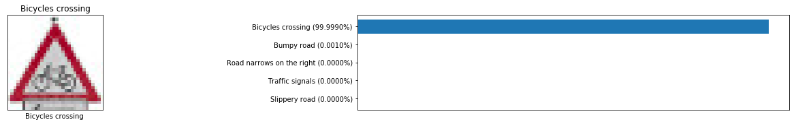

# **Traffic Sign Recognition**
### Project Submission for Patrick Poon

---

**Build a Traffic Sign Recognition Project**

The goals / steps of this project are the following:
* Load the data set (see below for links to the project data set)
* Explore, summarize and visualize the data set
* Design, train and test a model architecture
* Use the model to make predictions on new images
* Analyze the softmax probabilities of the new images
* Summarize the results with a written report

[//]: # (Image References)

[image1]: ./images/training_image_distribution.png "Visualization"
[image2]: ../examples/grayscale.jpg "Grayscaling"
[image3]: ../examples/random_noise.jpg "Random Noise"
[image4]: ../examples/placeholder.png "Traffic Sign 1"
[image5]: ../examples/placeholder.png "Traffic Sign 2"
[image6]: ../examples/placeholder.png "Traffic Sign 3"
[image7]: ../examples/placeholder.png "Traffic Sign 4"
[image8]: ../examples/placeholder.png "Traffic Sign 5"

## Rubric Points
---
Here I will consider the [rubric points](https://review.udacity.com/#!/rubrics/481/view) individually and describe how I addressed each point in my implementation.

### Writeup / README
---

##### 1. Provide a Writeup / README that includes all the rubric points and how you addressed each one. You can submit your writeup as markdown or pdf. You can use this template as a guide for writing the report. The submission includes the project code.

You're reading it! and here is a link to my [project code](https://github.com/patrickmpoon/CarND-Traffic-Sign-Classifier-Project/blob/master/Traffic_Sign_Classifier.ipynb)

### Data Set Summary & Exploration
----
**Provide a basic summary of the data set and identify where in your code the summary was done. In the code, the analysis should be done using python, numpy and/or pandas methods rather than hardcoding results manually.**

The code for this step is contained in the third cell of the IPython notebook.

I used Python and the NumPy library to calculate summary statistics of the traffic signs data set:

* The size of training set is 34,799
* The size of test set is 12,630
* The shape of a traffic sign image is (32, 32, 3)
* The number of unique classes/labels in the data set is 43

#### 2. Include an exploratory visualization of the dataset and identify where the code is in your code file.

The code for this step is contained in the cells 4, 5, 6, and 7 of the IPython notebook.

Here is an exploratory visualization of the data set. It is a horizontal bar chart showing how the
training images are heavily skewed and not evenly distributed. Speed limit signs are heavily
represented, while directional and contextual signs (pedestrians, bike crossing, bumpy roads) are
underrepresented.  Brightness and contrast varies across the different sign types.

### Design and Test a Model Architecture

#### 1. Describe how, and identify where in your code, you preprocessed the image data. What tecniques were chosen and why did you choose these techniques? Consider including images showing the output of each preprocessing technique. Pre-processing refers to techniques such as converting to grayscale, normalization, etc.

The code for this step is contained in cells 8, 9, and 10 of the IPython notebook.

First, I converted the images to grayscale to reduce the amount of data that would need to be
processed during training.  Several people from the earlier cohorts had commented that the three
color channels did not improve prediction accuracy.

Here is a comparison of an original image to its grayscaled image:

Finally, I normalized the data by subtracting 128 then dividing the difference by 128, in order to
properly scale the features.

#### 2. Describe how, and identify where in your code, you set up training, validation and testing data. How much data was in each set? Explain what techniques were used to split the data into these sets. (OPTIONAL: As described in the "Stand Out Suggestions" part of the rubric, if you generated additional data for training, describe why you decided to generate additional data, how you generated the data, identify where in your code, and provide example images of the additional data)

The code for splitting the data into training and validation sets is contained in the cell 2 of the IPython notebook.  

I did not perform any data augmentation manipulation of the pickled files (train.p, valid.p, and test.p) from the traffic-signs-data.zip file.  I simply extracted the "features" and "labels" arrays from the respective sets.

Here is a breakdown of the number of images per set:

* Training set: 34,799
* Validation set: 4,410
* Test set: 12,630

Augmenting the data would likely have yielded higher accuracy figures, but due to time constraints, I opted to forego this activity.

#### 3. Describe, and identify where in your code, what your final model architecture looks like including model type, layers, layer sizes, connectivity, etc.) Consider including a diagram and/or table describing the final model.

The code for my final model is located in the cell 11 of the IPython notebook. 

I used the LeNet architecture from Lesson 8, Convolutional Neural Networks, as a starting point.

My final model consisted of the following layers:

| Layer | Description | 
|:---------------------:|:---------------------------------------------:| 
| Input | 32x32x1 RGB image | 
| Convolution 5x5 | 1x1 stride, valid padding, outputs 28x28x64 |
| RELU | |
| Max pooling | 2x2 stride, valid padding, outputs 14x14x64 |
| Convolution 5x5 | 1x1 stride, valid padding, outputs 10x10x128 |
| RELU	| |
| Max pooling | 2x2 stride, valid padding, outputs 5x5x128 |
| Flatten | outputs 3200 |
| Fully connected | outputs 120 |
| RELU	 | |
| Fully connected | outputs 84 |
| RELU	| |
| Fully connected | outputs 43 |

#### 4. Describe how, and identify where in your code, you trained your model. The discussion can include the type of optimizer, the batch size, number of epochs and any hyperparameters such as learning rate.

The code for training the model was done in cells 12-14 of the IPython notebook. 

To train the model, I used the the Adam Optimizer with the following parameters:

* Batch size: 16
* Epochs: 20 
* Learning rate of 0.0003

#### 5. Describe the approach taken for finding a solution. Include in the discussion the results on the training, validation and test sets and where in the code these were calculated. Your approach may have been an iterative process, in which case, outline the steps you took to get to the final solution and why you chose those steps. Perhaps your solution involved an already well known implementation or architecture. In this case, discuss why you think the architecture is suitable for the current problem.

The code for calculating the accuracy of the model is located in the 14th cell of the Ipython notebook.

My final model results were:

* Training set accuracy of 99.9%
* Validation set accuracy of **96.6%**
* Test set accuracy of 94.1%

If an iterative approach was chosen:

* What was the first architecture that was tried and why was it chosen?

  The LeNet architecture was chosen per the instructions in Lesson 9: Deep Learning - 
  Traffic Sign Classifier.  It was a suggested as a good starting point.

* What were some problems with the initial architecture?

  The initial settings were woefully inadequate, as the LeNet code from Lesson 8
  were designed to classify number images in only 10 classes.  My initial accuracy
  numbers were less than 6%.  I realized that I needed to increase the number of
  classes to 43.  This increased the accuracy to around 86%, which was a huge
  improvement, but still well below the minimum threshold to pass this activity of 
  93%.

* How was the architecture adjusted and why was it adjusted? Typical adjustments could include choosing a different model architecture, adding or taking away layers (pooling, dropout, convolution, etc), using an activation function or changing the activation function. One common justification for adjusting an architecture would be due to over fitting or under fitting. A high accuracy on the training set but low accuracy on the validation set indicates over fitting; a low accuracy on both sets indicates under fitting.

  I experimented with various modifications, such as implementing dropout and adding 
  a third convolutional layer, but neither seemed to improve accuracy with the 
  parameter values I used.  So, I dropped them and focused on modifying different 
  hyperparameters for the LeNet architecture instead.

* Which parameters were tuned? How were they adjusted and why?

  I read in different forums that using a smaller batch size would result in lower 
  accuracy, but I found that a size of 16 provided better performance in my testing.

  Another hyperparameter that seems to have yielded performance benefits was the 
  number of filters used in the convolutional layers.  Increasing them to 64 in the 
  first layer, then 128 in the second layer resulted in higher prediction accuracy.

* What are some of the important design choices and why were they chosen? For example, why might a convolution layer work well with this problem? How might a dropout layer help with creating a successful model?

	If a well known architecture was chosen:
	
	* What architecture was chosen?
	
	  I stuck with the initial LeNet architecture suggested in the instructions.  The two
	  convolutional layers remove data that enables the model learn to make some
	  generalizations of different image patterns to adequately fit never before seen
	  images into various classes.
	  
	  A dropout layer might help as discarding a certain percentage of data will require
	  the model to generalize even further.
	
	* Why did you believe it would be relevant to the traffic sign application?
	
	  It had proven effective in classifying digits, and has been used effectively
	  by researchers in classifying different types of images.
	
	* How does the final model's accuracy on the training, validation and test set provide evidence that the model is working well?
	
	  By using separate images for training, validation, and testing, we can reasonably
	  assume that when the model is fed an image that it has never seen before, that it 
	  has learned a sufficient number of patterns to make an educated guess of what how 
	  the image should be classified during validation and testing, provided that the
	  prediction accuracies were in the 90th percentile.
  

### Test a Model on New Images

#### 1. Choose five German traffic signs found on the web and provide them in the report. For each image, discuss what quality or qualities might be difficult to classify.

Here are five German traffic signs that I found on the web:

I cropped and scaled them to 32 x 32 pixels to put them into a format that my model could process.
Here are a few thoughts on traits that could make them difficult to classify:

- The first sign (Speed limit 30 km/h) might be difficult to classify because of the noise in the background, such as the foliage and the road.  The sign is also slightly angled.
- The second sign (Bicycles crossing) might be difficult to classify because of the other traffic sign beneath it.
- The third (Children crossing) and fifth (Slippery road) signs may be difficult to classify as they are rotated and skewed.
- The fourth sign (No passing) should not be difficult to classify.  The sign is well-framed with a direct head-on view.

#### 2. Discuss the model's predictions on these new traffic signs and compare the results to predicting on the test set. Identify where in your code predictions were made. At a minimum, discuss what the predictions were, the accuracy on these new predictions, and compare the accuracy to the accuracy on the test set (OPTIONAL: Discuss the results in more detail as described in the "Stand Out Suggestions" part of the rubric).

The code for making predictions on my final model is located in cells 16 and 17 of the IPython notebook.

Here are the results of the prediction:

| Image			      | Prediction.          | 
|:--------------------:|:--------------------:| 
| Speed limit (30km/h) | Speed limit (30km/h) | 
| Bicycles crossing    | Bicycles crossing    |
| Children crossing    | Children crossing    |
| No passing           | No passing           |
| Slippery road        | Slippery road        |

The model was able to correctly guess 5 of the 5 traffic signs, which gives an accuracy of 100%. This compares favorably to the accuracy on the test set of 94%.

#### 3. Describe how certain the model is when predicting on each of the five new images by looking at the softmax probabilities for each prediction and identify where in your code softmax probabilities were outputted. Provide the top 5 softmax probabilities for each image along with the sign type of each probability. (OPTIONAL: as described in the "Stand Out Suggestions" part of the rubric, visualizations can also be provided such as bar charts)

The code for making predictions on my final model is located in the 18th cell of the Ipython notebook.

For the first image, the model is absolutely sure that this is a "Speed limit (30km/h)" sign with 100% confidence.

----

With the second image, the model is slightly less sure that this is a "Bicycles crossing" sign with 99.9990% confidence.  The next likely sign was a "Bumpy road" sign, but the chances of that are negligible at 0.0010%.

----

Next, for the third image, the model is relatively slightly less sure that this is a "Bicycles crossing" sign with 99.9957% confidence.  The next likely candidate would have been "Dangerous curve to the right" sign with a 0.0022% chance.

In previous model iterations, this sign was difficult to classify, and was frequently classified incorrectly.

----

With the fourth image, the model was once again absolutely positive that this is a "No passing" sign.

----

Finally, for the fifth and final traffic sign, it was also completely sure that this is a "Slippery
road" sign.

----

#### Visualization of the Neural Network's State for Sign 1

Here is a visualization of the 64 feature maps that were used in predicting Sign 1, Speed limit (30 km/h):

